## java代码格式化和静态分析检查

> 引言：在Java软件开发过程中，开发团队往往要花费大量的时间和精力发现并修改代码缺陷。Java 静态代码分析（static code analysis）工具能够在代码构建过程中帮助开发人员快速、有效的定位代码缺陷并及时纠正这些问题，从而极大地提高软件可靠性并节省软件开发和测试成本。

## 静态分析检查(CheckStyle)
我们初步制定了一个适合本部研发的 [java代码检查规范](Settings/ime_checkstyle.xml)，下面我们来看看如何在idea和vscode中来使用它。

### CheckStyle简介
Checkstyle是SourceForge旗下的一个开发工具，可以帮助程序员编写遵循编码标准的Java代码。它自动化了检查Java代码的过程，以避免人类完成这一枯燥（但很重要）的任务。这使得它非常适合那些希望实施编码标准的项目。Checkstyle是高度可配置的，可以支持几乎任何编码标准，默认内置Sun Java编码规范和Google Java编码规范两套配置文件，我们也可以根据自己的需要配置自己的规范。  

### IDEA 
+  ***安装：***  
1. 在Plugins-marketpalce中查找CheckStyle IDEA插件，点击Installed 安装
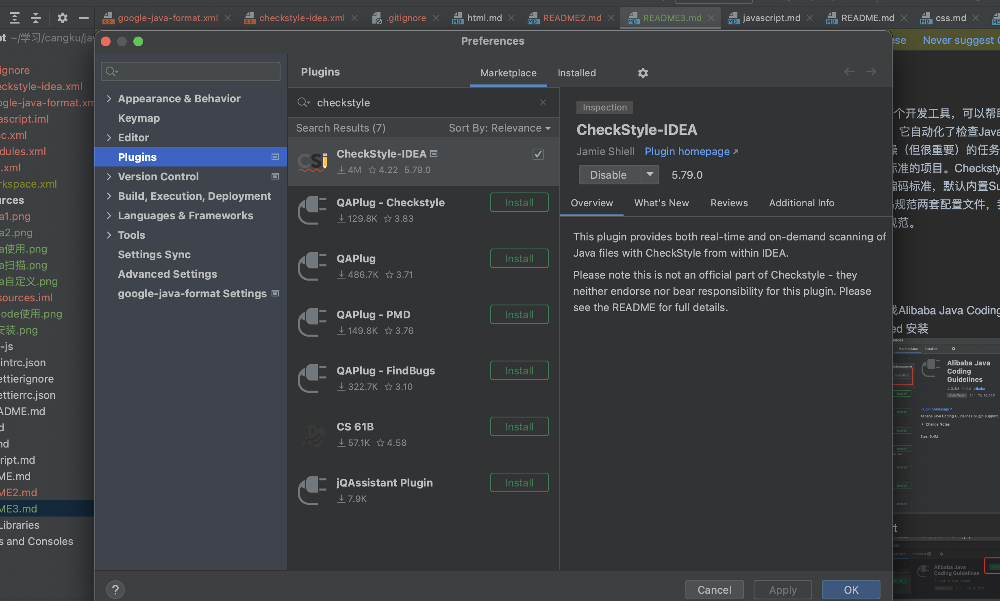

2. 完成安装后重启ide, 然后打开设置->Editor->Inspections，如果出现Checkstyle,则代表安装成功  
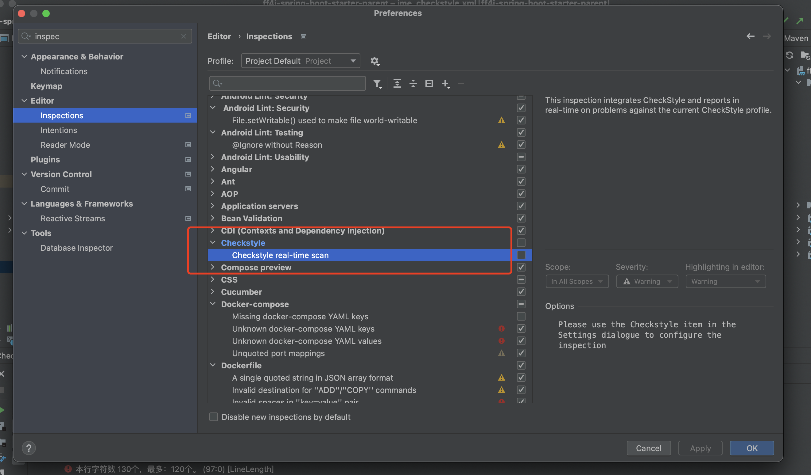

+ ***配置：***  
1. 在本地新建ime_checkstyle.xml配置文件,具体可参考 [ime_checkstyle.xml](Settings/ime_checkstyle.xml)

2. 导入配置文件：在ide配置中搜索checkstyle, 按下图导入上一步新建的ime_checkstyle.xml文件
   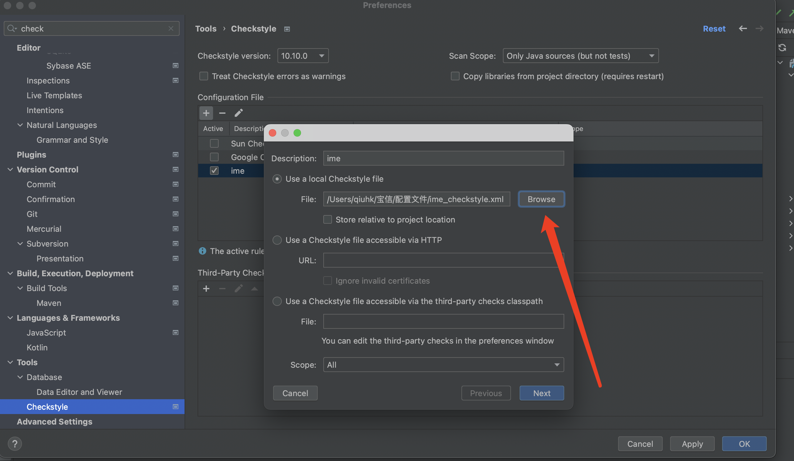

3. 勾选新增的配置文件，完成：
   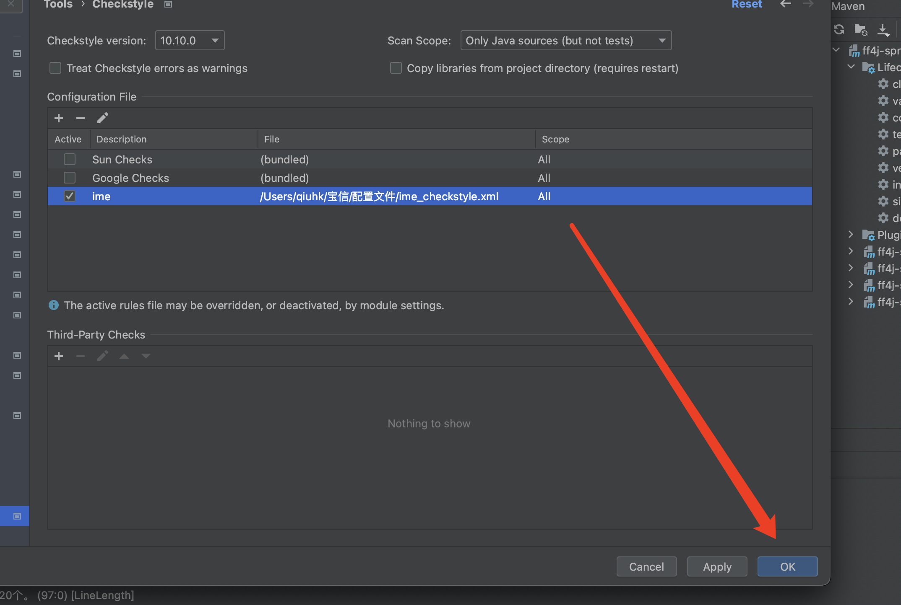

+ ***使用：***  

1. 首先打开一个文件，右键选择Check Current File:
   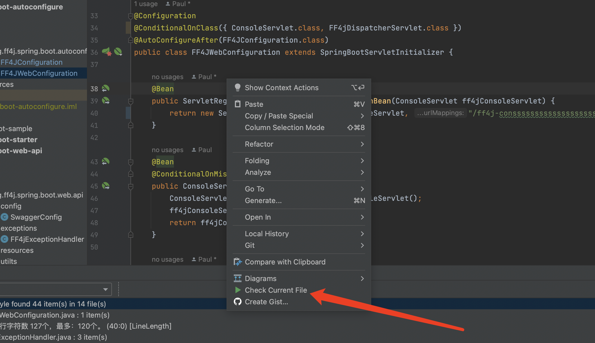

2. 记得这里的配置，选择我们刚刚配置的ime文件：
   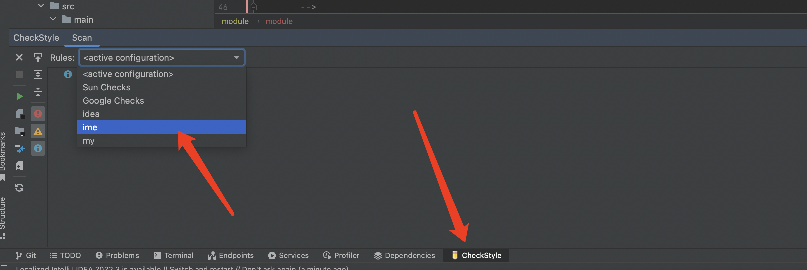

3. 除了单个文件以外，这里也有快捷方式可以针对整个project或者module进行检查：
   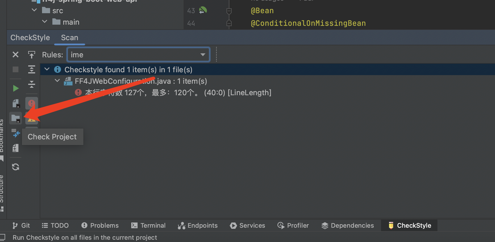
   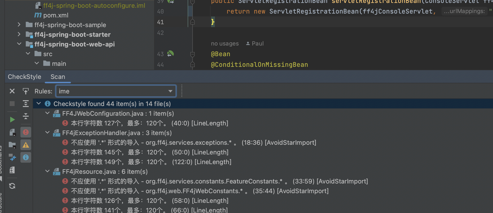

### VSCode 

+  ***安装：***
1. 打开配置里的Extensions选择，搜索Language Support for Java(TM) by Red Hat插件和Checkstyle for Java插件，并安装，安装完成后重启ide

   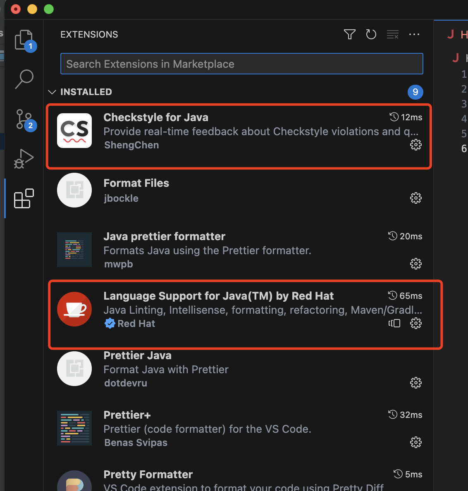

+ ***配置：***
1. 在项目根目录下新建ime_checkstyle.xml文件,内容具体可参考 [ime_checkstyle.xml](Settings/ime_checkstyle.xml)
   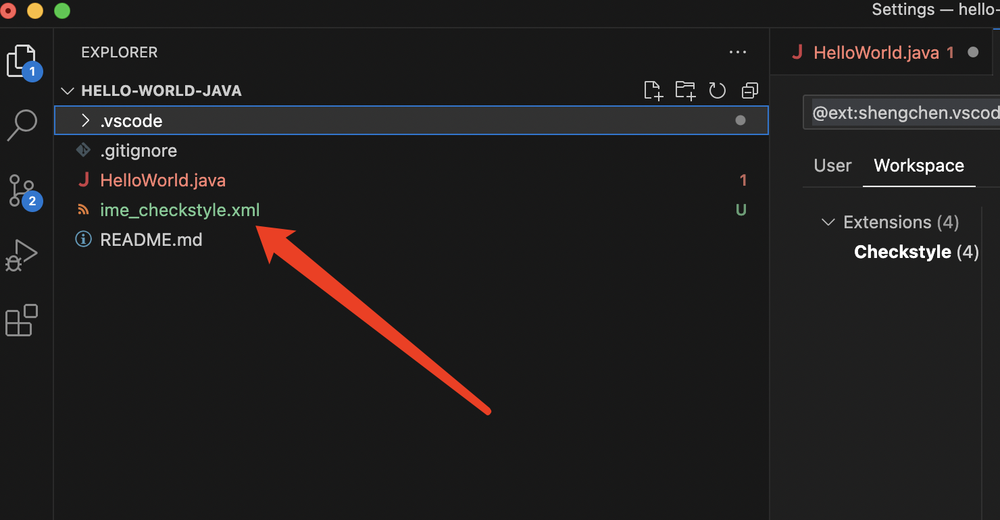

2. 打开CheckStyle for Java插件，点击Extension Settings选项：
   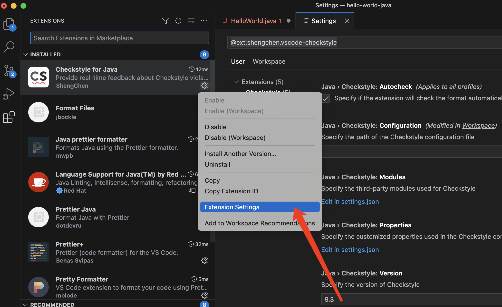

3. 选择Workspace页，填入根目录的配置文件，即${workspaceFolder}/ime_checkstyle.xml：
   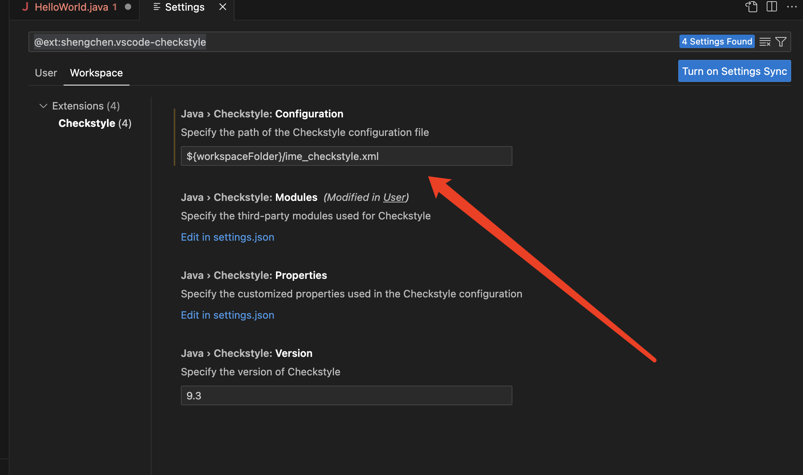

+ ***使用：***

1. 打开要检查的文件，即可展示代码的不规范之处:
   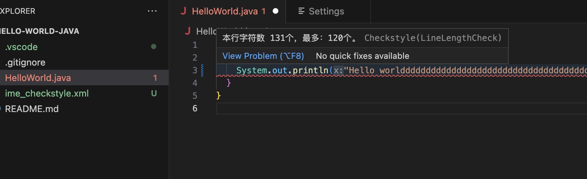

2. 也可批量使用，选择要操作的module，点击Check Code with Checkstyle:
   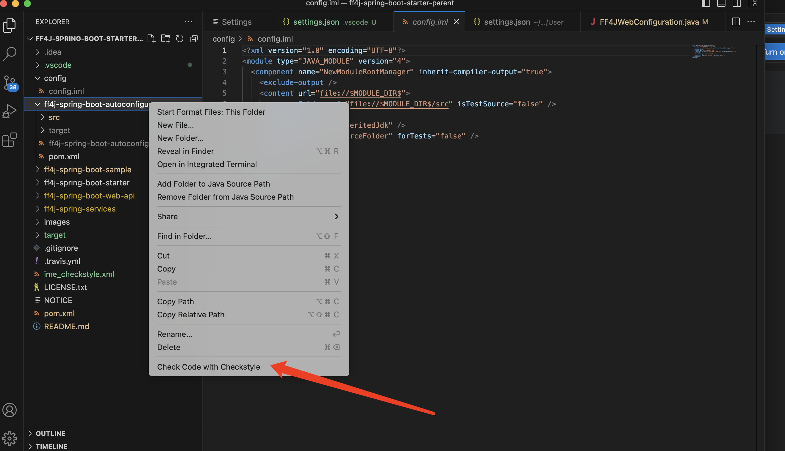

## 代码格式化(Formatter)

因为主流的ide工具都自带了formatter功能，下面我们以idea为例简单看下如何应用。

### IDEA
IDEA的format有个非常好的地方，即它支持Checkstyle configuration，这样就可以保持跟前面的checkstyle检查规范一致

+ ***配置：***
1. 依次打开配置下的Editor->Code Style->java，点击右侧的配置按钮，选择Import Schema:
   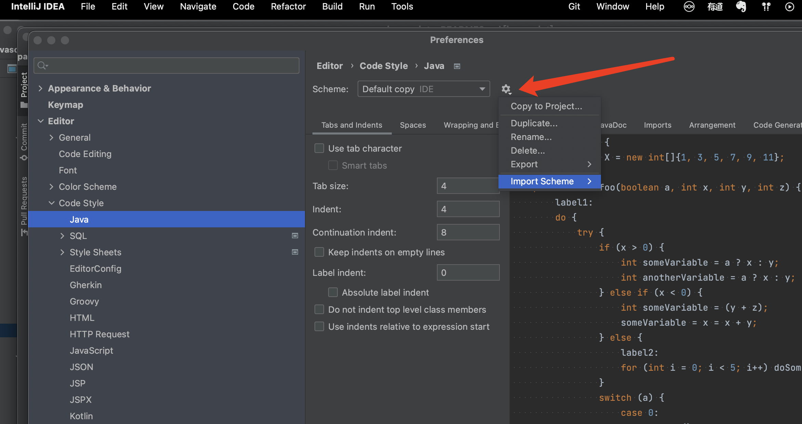

2. 选择Checkstyle configuration，导入我们前面新建的 [ime_checkstyle.xml](Settings/ime_checkstyle.xml): 
   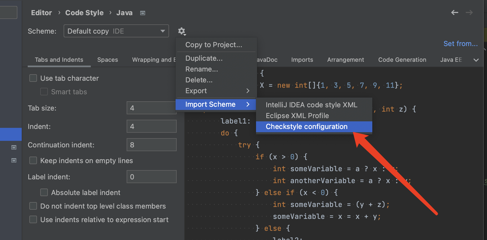

+ ***使用：***
1. 选择要format的project或者module, 直接Reformat Code即可
   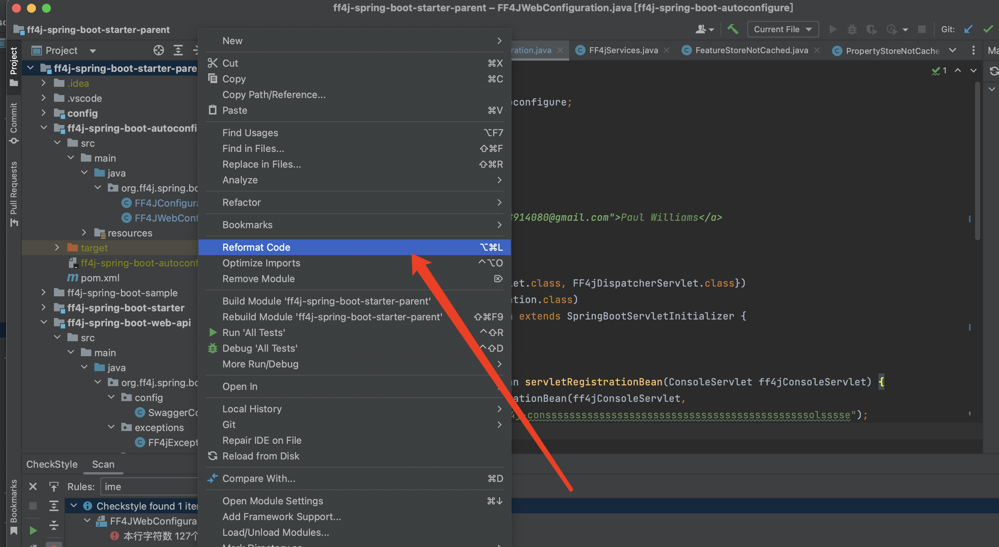

